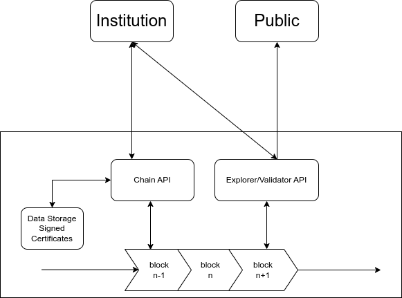
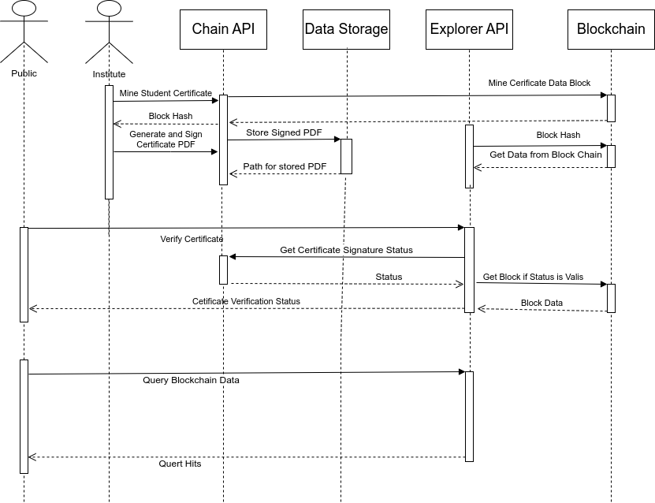

# Validation and Verification of Certificates using Blockchain

This project implements a typical blockchain that will store the certificate data in the chain and produce a digitally signed certificate in PDF format. The certificate information is first utilized to generate a block, mine it to the blockchain, and broadcast the mined block over the network. After that, the block data is used to generate a PDF file and digitally signed using the node private key.

### Architecture


### Working Sequence

1. Hash Code Generation
2. Digital Certificate Creation
3. Broadcast the Generated Block
4. Validation of digital certificates
5. Querying the Blockchain



### Sample Block
```
{
  "index": "0",
  "timestamp": "2023/05/01-07:15:08.224078",
  "previous_hash": "",
  "hash": "0000800b29b615c1fc719e9ec76f9aaafc280f0b8827f4f426174a046bc4ef9cb558348815ea59fee58a9ea34fe70d972cf7ca1d8032d0bba1a7246e5731db01",
  "data": {
    "name": "First Block",
    "parentName": "None",
    "registeredNumber": "None",
    "issuedDate": "01/01/1970",
    "stream": "None",
    "degree": "None",
    "institution": "None"
  },
  "reference_blocks": null,
  "nonce": "58174"
}
```
### Dependencies
- fastapi(ReST API)
- uvicorn(ASGI server)
- python-dotenv(Environment Variables)
- xhtml2pdf(PDF Rendering from HTML and Signing)
- pyhanko,pyhank-certvalidator(PDF Validation)
- whoosh(Search)
- jinja2(HTML Rendering)
- python-multipart(PDF Request Handling)
- gunicorn(WSGI Server)

### cURL Examples

curl -X POST http://127.0.0.1:8000/api/validate -H "accept: application/json" -H "Content-Type: multipart/form-data" -H "api_key:123456" -F "certPDF=@1-signed.pdf;type=application/pdf"

curl -X POST http://127.0.0.1:8000/api/search -H "Content-Type: application/json" -H "api_key:123456" -d '{"query":"kushwanth"}'

curl -X GET http://127.0.0.1:8000/api/data/000073341b8c87ef1b3cb8edda7e0695e68b0c36a8d2e261cc69d64f127049d349c5f592a9d9735a59de0954dc2db489d771280221e25d29f944ae1f51fdd965 -H "Content-Type: application/json" -H "api_key:123456"

curl -X POST http://127.0.0.1:8000/action/mine -H "Content-Type: application/json" -H "api_key:123456" -d '{"name": "Kushwanth", "parentName": "Kushwanth", "registeredNumber": "TGDE014667458", "issuedDate": "30/08/2007", "stream": "HUMAN RESOURCES", "degree": "Business", "institution": "WERTYUABCDEFGHIJKLMNOPQRSTUVWXYZQDFGHJKSDFGHJSDFGHERTYQWER"}'

